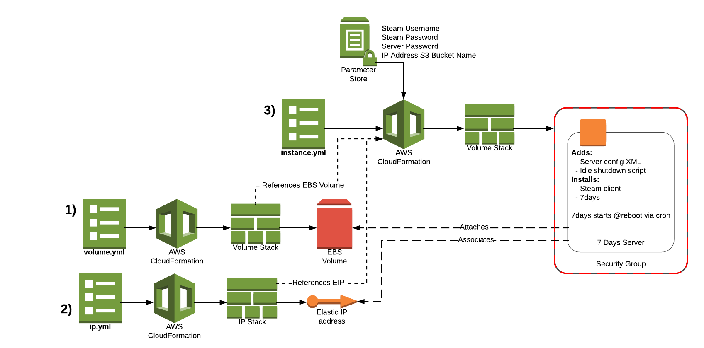

# 7 Days to Die - Dedicated Server on AWS
Run a dedicated 7 Days to Die server with start/stop access control, idle shutdown when no players connected and a static IP address.

## Architecture
The architecture consists of three main components. An EBS Volume of 100GB, an Elastic IP Address and an EC2 Instance. The volume is deployed separately, so the instance can be re-deployed without deleting the volume, keeping any existing game data between instances.


## Configuration
The main 7 Days to Die server configuration is controlled via the XML file injected during the cfn-init process. This is located in the metadata of the EC2 Instance resource in `instance.yml`

## Deployment
There are three main CloudFormation templates. The EIP and EBS Volume templates can be run in any order. The EC2 Instance template must be run after both of the other templates have been deployed.
  1. Deploy `ip.yml`
  2. Deploy `volume.yml`
  3. Ensure you have the following SSM Parameters:
    - steam-username: Username for Steam account to use
    - steam-password: Password for Steam account to use
    - 7days-password: Password for the server itself
    - 7days-server-ip-bucket: An S3 bucket name to upload `7dserver.txt`, containing server IP and port in `0.0.0.0:8080` format.
  4. Deploy `instance.yml`

## Usage
Check the Stack output of `instance.yml` or the S3 bucket (`s3://${S3BucketName}/7dserver.txt`) for the IP and port of the server you have deployed. Then connect to it using 7 Days to Die.

### Start/Stop Access Control
If you make an IAM User for people who want to be able to turn on the server on-demand then you can provide them `7days.bat` to enable them to easily turn on and off the right server, without them knowing the current instance ID.

Pass in the action (either start or stop). You can optionally provide an AWS CLI profile name to use instead of the default e.g. `7days.bat start myprofile`

If you would like to lock down the IAM User to only be able to control this 7 Days server then attach this policy to the user:
```json
{
  "Version": "2012-10-17",
  "Statement": [{
      "Action": [
        "ec2:StartInstances",
        "ec2:StopInstances",
        "ec2:RebootInstances"
      ],
      "Condition": {
        "StringEquals": {
          "ec2:ResourceTag/AccessControl": "7Days"
        }
      },
      "Resource": "*",
      "Effect": "Allow"
    },
    {
      "Effect": "Allow",
      "Action": "ec2:Describe*",
      "Resource": "*"
    }
  ]
}
```

### Idle Shutdown
A cronjob is installed to run each hour using an automated telnet connection in `/opt/games/7days/listplayers.sh`. This lists the number of players currently connected to the server. If the number equals 0 then the server will shutdown.

