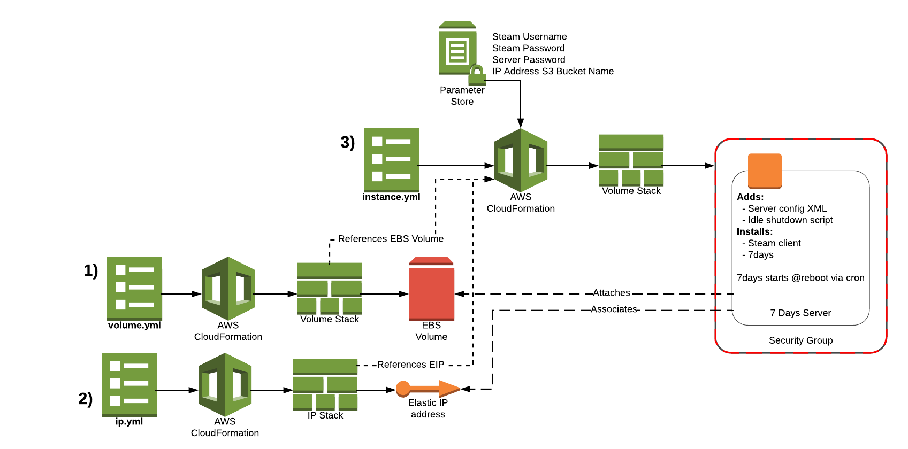

# 7 Days to Die - Dedicated Server on AWS
Run a dedicated 7 Days to Die server with start/stop access control, idle shutdown when no players connected and a static IP address.

## Architecture
The architecture consists of three main components. A 100GB gp3 EBS Volume, an Elastic IP Address and an EC2 Instance. The instance defaults to `r8i.xlarge` (4 vCPU / 32 GiB), memory-optimized for large V3.0 random-gen worlds; override the `InstanceType` parameter for smaller maps. The volume is deployed separately, so the instance can be re-deployed without deleting the volume, keeping any existing game data between instances. The instance runs Ubuntu 24.04 LTS (The Fun Pimps' officially supported Linux target) and runs the server under systemd. The save volume is mounted at `/opt/games`, the server is installed at `/opt/games/7days`, and the game's user-data folder (worlds, saves, player profiles) is placed at `/opt/games/userdata` so all game state lives on the persistent volume.


## Configuration
The main 7 Days to Die server configuration is a `serverconfig.xml` written to `/opt/games/7days/serverconfig.xml` by the instance's UserData script (defined inline in `instance.yml`).

As of 7 Days to Die V3.0, gameplay settings (difficulty, zombie speed, loot, blood moon, drop-on-death, day length, air drops, etc.) are no longer individual properties. They are all encoded in a single `SandboxCode` string, exposed here as the `SandboxCode` CloudFormation parameter. Generate your own from the in-game Sandbox Options menu; the default is the standard Adventurer preset.

## Deployment
There are three main CloudFormation templates. The EIP and EBS Volume templates can be run in any order. The EC2 Instance template must be run after both of the other templates have been deployed.
  1. Deploy `ip.yml`
  2. Deploy `volume.yml`
  3. Ensure you have the following SSM Parameters:
    - 7days-password: Password for the server itself
    - 7days-server-ip-bucket: An S3 bucket name to upload `7dserver.txt`, containing server IP and port in `0.0.0.0:26900` format.
  4. Deploy `instance.yml`

The dedicated server (Steam app 294420) is downloaded with an anonymous Steam login, so no Steam credentials are required.

### Region and Availability Zone
Deploy all three stacks in the same region. The default target is `ap-southeast-6` (New Zealand), which is what `7days.bat` is set to; the instance-type default (`r8i.xlarge`) is chosen for what that region offers. If you deploy elsewhere, pick an `InstanceType` available there (note: 7 Days to Die has no ARM64 server build, so Graviton instances such as `r8g`/`m8g` will not work).

`volume.yml` and `instance.yml` both pin the Availability Zone to `${AWS::Region}a`, and the volume and instance must share an AZ. Confirm your chosen instance type is offered in the `-a` AZ of your region; if not, change the `a` suffix in both templates to a supporting AZ.

## Usage
Check the Stack output of `instance.yml` or the S3 bucket (`s3://${S3BucketName}/7dserver.txt`) for the IP and port of the server you have deployed. Then connect to it using 7 Days to Die. The default game port is UDP/TCP 26900.

### Start/Stop Access Control
If you make an IAM User for people who want to be able to turn on the server on-demand then you can provide them `7days.bat` to enable them to easily turn on and off the right server, without them knowing the current instance ID.

Pass in the action (either start or stop). You can optionally provide an AWS CLI profile name to use instead of the default e.g. `7days.bat start myprofile`

If you would like to lock down the IAM User to only be able to control this 7 Days server then attach this policy to the user:
```json
{
  "Version": "2012-10-17",
  "Statement": [{
      "Action": [
        "ec2:StartInstances",
        "ec2:StopInstances",
        "ec2:RebootInstances"
      ],
      "Condition": {
        "StringEquals": {
          "ec2:ResourceTag/AccessControl": "7Days"
        }
      },
      "Resource": "*",
      "Effect": "Allow"
    },
    {
      "Effect": "Allow",
      "Action": "ec2:Describe*",
      "Resource": "*"
    }
  ]
}
```

### Idle Shutdown
A systemd timer (`7dtd-idle.timer`) runs `/usr/local/bin/7dtd-idle-check` every 20 minutes. It uses an automated telnet connection (`/usr/local/bin/7dtd-listplayers`) to read how many players are currently connected. If it positively reads zero players the instance is shut down (stopped) to save cost. If the server or its telnet console is unreachable it does nothing, so the instance is never shut down before the server has started.

