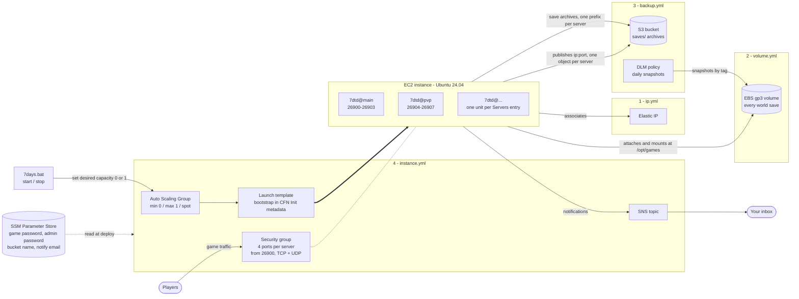
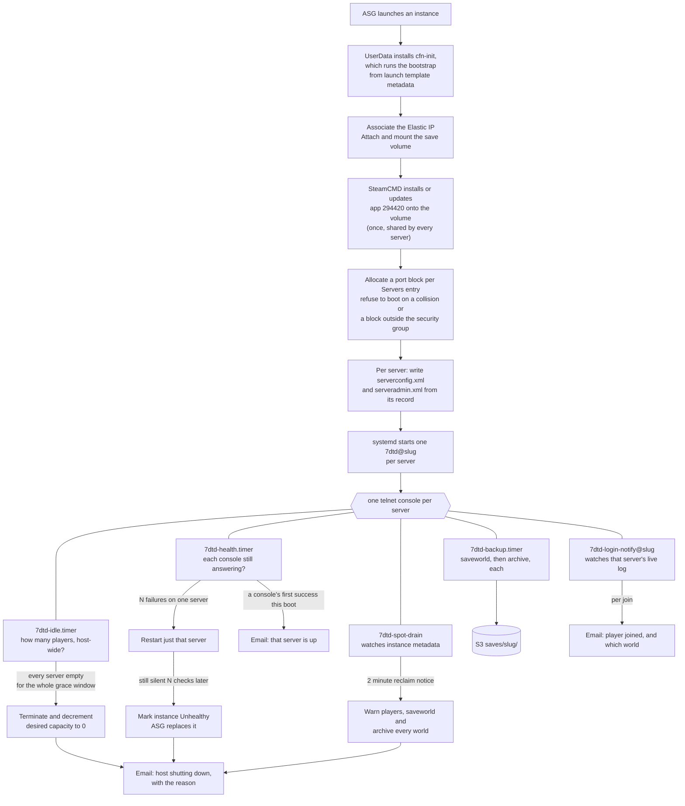

# 7 Days to Die - Dedicated Server on AWS
Run one or more dedicated 7 Days to Die servers that scale to zero when empty, with start/stop access control, idle shutdown when no players are connected, self-healing, email notifications when a server starts or stops and when a player logs in, and a static IP address.

## Architecture
The architecture consists of three main components. An EBS volume for the saves (100 GB gp3 by default), an Elastic IP Address and an Auto Scaling Group. The ASG runs `MinSize 0 / MaxSize 1`: it holds zero instances when nobody is playing (so there is no compute cost) and one instance when the servers are up. Max is 1 by design - a 7DTD dedicated server is a single authoritative process owning one world save, and it cannot be spread across machines, so there is nothing to scale horizontally. The instance defaults to `r8i.xlarge` (4 vCPU / 32 GiB), memory-optimized for large V3.0 random-gen worlds; override the `InstanceType` parameter for smaller maps or for more worlds. The volume is deployed separately, so instances can be re-launched without deleting the volume, keeping any existing game data between instances. Each instance runs Ubuntu 24.04 LTS (The Fun Pimps' officially supported Linux target) and runs the servers under systemd.

That one instance can host **several worlds at once**. 7DTD accepts `-configfile` and `-userdatafolder` per process, so a single game install serves N independent servers as N systemd units, each with its own world, its own port block and its own admin list. The `Servers` parameter is the list of them; its default is a single server, and everything below describes both cases. The save volume is mounted at `/opt/games`, the game is installed once at `/opt/games/7days`, each server's user-data folder (world, saves, player profiles) is at `/opt/games/userdata/<slug>`, and its generated `serverconfig.xml` at `/etc/7dtd/<slug>/` - so all game state lives on the persistent volume and every server is isolated from every other by its save folder.

Because the ASG launches instances from a launch template rather than managing one persistent instance, each launch re-runs the UserData bootstrap: it self-attaches the save volume, self-associates the Elastic IP, and rewrites every server's `serverconfig.xml`. This makes the template the source of truth (no config drift), but it also means the ASG does not attach the volume or IP for you - the instance does that itself on boot. A stack update that changes the launch template applies on the *next* launch; it does not roll a running server.

The bootstrap also installs the CloudWatch agent, which ships in-guest metrics EC2 does not publish by default - memory, swap and filesystem usage (root and the `/opt/games` save volume) plus CPU breakdown - to the `7DaysServer` CloudWatch namespace, tagged with instance id, instance type and ASG name.

### What each stack creates
The four stacks are deployed in order. Each publishes CloudFormation exports; the instance stack is the only one that consumes them, and it does so at boot from the instance rather than at deploy time, which is why the volume and IP stacks can be replaced without touching it.


```mermaid
flowchart LR
  ssm[("SSM Parameter Store<br/>game password, admin password<br/>bucket name, notify email")]
  bat["7days.bat<br/>start / stop"]
  players(["Players"])
  mail(["Your inbox"])

  subgraph s1["1 - ip.yml"]
    eip["Elastic IP"]
  end

  subgraph s2["2 - volume.yml"]
    vol[("EBS gp3 volume<br/>every world save")]
  end

  subgraph s3["3 - backup.yml"]
    bucket[("S3 bucket<br/>saves/ archives")]
    dlm["DLM policy<br/>daily snapshots"]
  end

  subgraph s4["4 - instance.yml"]
    asg["Auto Scaling Group<br/>min 0 / max 1 / spot"]
    lt["Launch template<br/>bootstrap in CFN Init metadata"]
    sg["Security group<br/>4 ports per server<br/>from 26900, TCP + UDP"]
    sns["SNS topic"]
  end

  subgraph ec2["EC2 instance - Ubuntu 24.04"]
    s_a["7dtd@main<br/>26900-26903"]
    s_b["7dtd@pvp<br/>26904-26907"]
    s_n["7dtd@...<br/>one unit per Servers entry"]
  end

  ssm -.->|read at deploy| s4
  bat -->|set desired capacity 0 or 1| asg
  asg --> lt
  lt ==> ec2
  ec2 -->|associates| eip
  ec2 -->|attaches and mounts at /opt/games| vol
  ec2 -->|save archives, one prefix per server| bucket
  ec2 -->|publishes ip:port, one object per server| bucket
  ec2 -->|notifications| sns
  sns --> mail
  dlm -->|snapshots by tag| vol
  players -->|game traffic| sg
  sg -.- ec2
```

### What a launch does
The ASG launches from a launch template rather than managing one persistent instance, so every launch re-runs the whole bootstrap. That is what makes the template the source of truth: every server's config and admin list are rewritten from stack parameters each time, and cannot drift. It also means the ASG does not attach the volume or the IP for you - the instance does that itself.

Everything that supervises a running game talks to it through that server's own telnet console, rather than parsing a log file whose name changes every launch. The host-wide checks (idle, self-heal, refresh, backup) walk every server in turn.


```mermaid
flowchart TB
  boot["ASG launches an instance"] --> init["UserData installs cfn-init,<br/>which runs the bootstrap<br/>from launch template metadata"]
  init --> claim["Associate the Elastic IP<br/>Attach and mount the save volume"]
  claim --> steam["SteamCMD installs or updates<br/>app 294420 onto the volume<br/>(once, shared by every server)"]
  steam --> ports["Allocate a port block per Servers entry<br/>refuse to boot on a collision or<br/>a block outside the security group"]
  ports --> cfg["Per server: write serverconfig.xml<br/>and serveradmin.xml from its record"]
  cfg --> run["systemd starts one 7dtd@slug<br/>per server"]
  run --> console{{"one telnet console per server"}}

  console --- health["7dtd-health.timer<br/>each console still answering?"]
  console --- idle["7dtd-idle.timer<br/>how many players, host-wide?"]
  console --- backup["7dtd-backup.timer<br/>saveworld, then archive, each"]
  console --- login["7dtd-login-notify@slug<br/>watches that server's live log"]
  console --- spot["7dtd-spot-drain<br/>watches instance metadata"]

  health -->|a console's first success this boot| up["Email: that server is up"]
  health -->|N failures on one server| restart["Restart just that server"]
  restart -->|still silent N checks later| unhealthy["Mark instance Unhealthy<br/>ASG replaces it"]
  idle -->|every server empty<br/>for the whole grace window| zero["Terminate and decrement<br/>desired capacity to 0"]
  backup --> s3[("S3 saves/slug/")]
  login -->|per join| joined["Email: player joined, and which world"]
  spot -->|2 minute reclaim notice| drain["Warn players, saveworld and<br/>archive every world"]
  zero --> stopmail["Email: host shutting down,<br/>with the reason"]
  unhealthy --> stopmail
  drain --> stopmail
```

### What actually limits performance
A 7DTD dedicated server is CPU and memory bound, not disk bound. The simulation runs on one dominant thread, so single-core speed sets the ceiling on zombie AI, pathfinding and block updates. That is why one *world* cannot be spread across machines, and why `MaxSize` is 1. Memory is the other constraint, and it scales with world size and how many chunks are loaded across your players; that is what the memory-optimized default instance is for.

Several worlds on one box is a different question, and the answer is that they do not share: each is its own process with its own dominant thread and its own resident world. So **sizing is roughly additive**. Budget a core and a world's worth of RAM per server before adding one, and remember that per-server caps like `MaxSpawnedZombies` (64 by default) multiply - three servers at the default cap is 192 zombies simulating on one host. Cut them down per server through that record's `ServerPropertyOverrides`, and move `InstanceType` (and the ASG's `Overrides` list) up as you add worlds. Adding a second world to an `r8i.xlarge` sized for one is the fastest way to make both feel worse than either did alone.

Disk only shows up in bursts: the first SteamCMD install, world generation, chunk streaming as players travel, and the write spike when a world is saved. Extra servers add save spikes but not much steady load, and they share one game install rather than duplicating 15+ GB each. Between those, the host's page cache holds the hot region files, so most reads never reach the volume at all. `gp3` gives 3000 IOPS and 125 MiB/s at any size, which covers those bursts with room to spare - spending more on provisioned IOPS buys headroom this workload does not use. The one choice that would genuinely hurt is an HDD-backed type, which is why `VolumeType` does not offer one.

Size the volume for capacity rather than speed: the game install plus SteamCMD is the bulk of it and is shared by every server, and each world save grows slowly with explored area.

## Configuration
The main 7 Days to Die server configuration is a `serverconfig.xml` written to `/etc/7dtd/<slug>/serverconfig.xml` by the instance's bootstrap (defined in `instance.yml`), one per server. It is rewritten on every launch from the stack's parameters, so the template is the source of truth and the config never drifts. Nothing about the server needs you to edit the template: everything is a CloudFormation parameter.

As of 7 Days to Die V3.0, gameplay settings (difficulty, zombie speed, loot, blood moon, drop-on-death, day length, air drops, etc.) are no longer individual properties. They are all encoded in a single `SandboxCode` string, which each `Servers` record sets for itself - so two worlds on the same host can play at different difficulties. Generate your own from the in-game Sandbox Options menu; the default is the standard Adventurer preset.

### The `Servers` parameter
`Servers` is a JSON array, one object per world the instance hosts. **Every per-server setting lives here and nowhere else**; the parameters in the next section are host-level. Its default, `[{"Slug":"main"}]`, is a single server on the built-in defaults, so a deployment that never touches it behaves as a single-server deployment.

```json
[
  {"Slug": "main"},
  {"Slug": "pvp", "ServerName": "PvP Realm", "GameName": "PvPWorld", "PlayerKillingMode": "3",
   "ServerPropertyOverrides": "MaxSpawnedZombies=32"},
  {"Slug": "nav", "ServerName": "Navezgane", "GameWorld": "Navezgane", "GameName": "NavWorld"}
]
```

`Slug` is the only required field: 1-32 characters of `A-Za-z0-9_-` starting alphanumeric. It names that server's save folder, systemd unit, S3 address object and backup prefix, so **keep it stable** - changing a slug starts a new world rather than renaming the old one.

| Field | Used when omitted | What it does |
| --- | --- | --- |
| `Slug` | *required* | Identity of this server on the host and in S3. |
| `ServerName` | `7 Days to Die on AWS` | Name in the server browser. |
| `ServerDescription` | generic | Description in the server browser. |
| `ServerWebsiteURL` | empty | Website link in the server browser. |
| `ServerVisibility` | `2` | `0` not listed (join by IP), `1` friends only, `2` public listing. |
| `ServerMaxPlayerCount` | `16` | Maximum concurrent players. |
| `ServerReservedSlots` / `ServerReservedSlotsPermission` | `2` / `100` | Slots held for players at or above that permission level. |
| `AdminSteamIds` | empty | Comma-separated SteamID64s to make admins. **Empty means nobody is an admin.** |
| `AdminPermissionLevel` | `0` | Level given to those ids. 0 is full admin, 1000 is a plain player: lower means more power. |
| `GameWorld` | `RWG` | `RWG` for random-gen, or a prebuilt world such as `Navezgane`. |
| `GameName` | `SevenDaysOnAws` | Save name. Changing it starts a new world instead of loading the existing save. |
| `WorldGenSeed` / `WorldGenSize` | `SevenDaysOnAws` / `6144` | Random-gen seed and size (4096-16384, multiple of 1024). Only used for `RWG`, and only when the world is first generated. |
| `SandboxCode` | Adventurer preset | V3.0 gameplay settings blob. |
| `PlayerKillingMode` | `2` | 0 none, 1 allies only, 2 strangers only, 3 everyone. |
| `WebDashboardEnabled` | `true` | Whether this server's web dashboard listens. Its port is not opened by the security group either way. |
| `ServerPropertyOverrides` | empty | Anything else in this server's `serverconfig.xml`. See [Setting anything else](#setting-anything-else). |

Give each world its own `ServerName` and `GameName` - two servers left on the defaults show up under the same name with the same seed.

These land in `serverconfig.xml` as attribute values, so any text must be XML-safe: write `&` as `&amp;` and `<` as `&lt;`, and do not use a double quote.

**Ports come from each record's position in the list, not from the record.** Server *N* (counting from zero) gets game ports `26900 + 4N` through `+3`, telnet `TelnetPort + N`, and web dashboard `WebDashboardPort + N`. So the example above listens on 26900-26903, 26904-26907 and 26908-26911. There is nothing to raise as you add servers: the security group opens a fixed 26900-26999, which is **25 servers** - far more than one instance could run, and the bootstrap refuses a 26th rather than bringing up a world nobody can reach. Setting `ServerPort`, `TelnetPort` or `WebDashboardPort` through a record's `ServerPropertyOverrides` is refused too, because it would move that server onto a neighbour's ports behind the allocator's back.

The one thing to plan for is that **reordering the list re-assigns ports**. Append new servers rather than inserting them, or players' saved entries point at the wrong world.

Removing a record stops that server's units on the next launch (or within the cfn-hup poll interval) and deletes its generated config. **Its save data is left on the volume**, so putting the record back with the same slug resumes the same world.

Everything that supervises the host is per-host, not per-server: `7days.bat` starts and stops all of them together, and idle shutdown fires only when *every* world is empty. See [Idle Shutdown](#idle-shutdown).

### Parameters
These are the host-level settings - the instance, the volume, the ports, the schedules. Everything a single world decides for itself is a `Servers` field instead.

Every parameter has a working default except `SubnetId`, `VpcId` and `KeyPair`, so a default deployment gives you one server with no admins, and no join password if `7days-game-password` holds `none`. Four defaults - `GamePassword`, `AdminPassword`, `S3BucketName` and `NotifyEmail` - are SSM parameter *names*, and those parameters must exist before you deploy (step 4 below).

| Parameter | Default | What it does |
| --- | --- | --- |
| `Servers` | `[{"Slug":"main"}]` | JSON list of the worlds this instance hosts, and every per-server setting. See [The `Servers` parameter](#the-servers-parameter). |
| `GamePassword` | `7days-game-password` | **Name of** the SSM parameter holding the join password, shared by every server. See below. |
| `AdminPassword` | `7days-admin-password` | **Name of** the SSM parameter holding the console password, shared by every server. See below. |
| `TelnetPort` / `WebDashboardPort` | `8081` / `8200` | Console and dashboard *base* ports; server N gets base + N. Neither is opened by the security group. The game port range is not a parameter - it is a fixed 26900-26999. |
| `AutoShutdown` | `enabled` | Whether to scale to zero when every world is empty. |
| `IdleGraceMinutes` / `IdleCheckMinutes` | `120` / `20` | Idle grace window and how often it is checked. |
| `HealthCheckMinutes` / `HealthCheckFailureThreshold` | `5` / `3` | Self-heal poll interval, and consecutive failures before a server is restarted (and again before the instance is replaced). |
| `BackupIntervalHours` | `24` | S3 save-archive cadence during a long session. |
| `DailyRefresh` / `DailyRefreshTime` | `enabled` / `15:00` | Whether the instance replaces itself once a day, and the UTC time it checks. |
| `InstanceType` | `r8i.xlarge` | Must be x86-64: 7DTD has no ARM64 server build. Size it for the number of worlds. |
| `AddressObjectPrefix` | `7dserver-` | Key prefix under `S3BucketName`; each server's `ip:port` is written to `<prefix><slug>.txt`. |
| `AccessControlTagValue` | `7Days` | Value of the `AccessControl` tag that `7days.bat` and the IAM policy below match on. Give each deployment its own value if you run more than one. |

`volume.yml` takes `VolumeSize` (100 GiB), `VolumeType` (gp3), `AvailabilityZoneSuffix` (`a`), `VolumeName` and `BackupTagValue`. `backup.yml` takes `RetentionDays` (14), `SnapshotTimeUTC` (16:00) and the matching `BackupTagValue`.

### Passwords
There are two, deliberately separate, and both are read from SSM Parameter Store so no password is ever committed to the template.

**Both template parameters take an SSM parameter *name*, not a password.** `GamePassword` defaults to `7days-game-password` and `AdminPassword` to `7days-admin-password`; the passwords themselves are the *values* you store under those names. Typing a password - or the literal `none` - into the template parameter makes CloudFormation look for an SSM parameter of that name, and the stack fails.

- **`GamePassword`** names the parameter holding what players type to join. An SSM parameter cannot hold an empty string, so store the literal text `none` **in that SSM parameter** to run an **open server** that anyone with the address can join. That is the setup this repo's defaults describe: a public listing (`ServerVisibility=2`) with no join password.
- **`AdminPassword`** names the parameter holding the server console (`TelnetPassword`) password. It is an operator credential, not a player one: the idle check, self-heal check, spot drain and login watcher all drive the game through that console. Both passwords are host-wide: every server on the instance shares them. The telnet ports are bound on the instance and are not opened by the security group, and the scripts holding this password are root-only (`0700`) so the game processes themselves cannot read it. To give one world its own join password, set `ServerPassword` in that record's `ServerPropertyOverrides`.

The web dashboard, when enabled, authenticates through the game's own admin/permission system rather than a separate password property, and its port is likewise not exposed by the security group.

### Admins
A record's `AdminSteamIds` is a comma-separated list of SteamID64s (the 17-digit number at the end of a `steamcommunity.com/profiles/...` URL). They are written to that server's `serveradmin.xml` at its `AdminPermissionLevel`, which defaults to `0`: full admin. **The default is an empty list, so a fresh deployment has no admins at all** until you name your own.

Admins are per world, which is the point of them being a `Servers` field - a PvP or test world can have a different list from the main one.

Because `serveradmin.xml` is rewritten on every launch, in-game admin, whitelist and ban edits do not survive a relaunch. Change the parameter and update the stack instead.

### Setting anything else
A record's `ServerPropertyOverrides` reaches every `serverconfig.xml` property that has no field of its own: land claims, zombie and animal caps, safe zones, EAC, crossplay, dynamic mesh, and any property added by a future game version. Pass comma-separated `Name=Value` pairs:

```
MaxSpawnedZombies=64,EACEnabled=false,LandClaimSize=71,BedrollDeadZoneSize=30
```

Each pair replaces that property if the template already writes it, and is appended if it does not. A value may contain `=` but not `,`, and any text landing in the XML must be XML-safe (`&amp;` rather than a bare `&`, no double quotes).

Like every other `Servers` field it applies to one world only, so a single server can be tuned without touching the others. It cannot set `ServerPort`, `TelnetPort` or `WebDashboardPort`: those are allocated from the record's index, and an override would move this server onto a neighbour's ports. The bootstrap refuses to start rather than let that happen.

## Deployment
There are four CloudFormation templates. `ip.yml` and `volume.yml` can be run in any order. `backup.yml` must run after `volume.yml` (its snapshot policy targets the volume by tag). The instance/ASG template must run last, after all three others (it imports the backup bucket ARN).
  1. Deploy `ip.yml`
  2. Deploy `volume.yml`
  3. Deploy `backup.yml`
  4. Create the following SSM Parameters (plain `String`; the names are themselves parameters of `instance.yml` if you want different ones):
    - `7days-game-password`: the password players type to join, or the literal text `none` for an open server (see [Passwords](#passwords))
    - `7days-admin-password`: the server console password
    - `7days-server-ip-bucket`: An S3 bucket name to upload each server's address file to, containing its IP and port in `0.0.0.0:26900` format.
    - `7days-notify-email`: Email address for server start/stop and player login notifications (see [Email notifications](#email-notifications))
  5. Deploy `instance.yml`, passing a `SubnetId` in the same Availability Zone as the volume and EIP (`${AWS::Region}a` by default), plus whichever of the parameters above you want to change - at minimum a `Servers` value naming your world and its admins, since a fresh deployment has no admins.
  6. Confirm the SNS email subscription from the "AWS Notification - Subscription Confirmation" email sent to `7days-notify-email`. Until that link is clicked, no notifications are delivered.

The dedicated server (Steam app 294420) is downloaded with an anonymous Steam login, so no Steam credentials are required.

The ASG is created at desired capacity 0 (no instance running), so nothing costs compute until you start the server on demand (see below).

## Tests
The whole server bootstrap lives as one `Fn::Sub` block inside `instance.yml`'s launch template metadata, where nothing can run it or lint it. `tests/` extracts it, resolves the CloudFormation references against fixed test values, and drives the parts worth testing against a stubbed telnet console and a scratch filesystem:

```
./tests/run.sh
```

It needs `bash`, `python3` and `jq`, uses `shellcheck` if it is installed, and touches no AWS account. It covers port allocation and every validation that refuses a deployment, per-server config and admin generation, property overrides, what a cfn-hup re-run does to a dropped server, that the passwords never reach the launch log, and the multi-server supervision logic (idle scale-down only when every world is empty, restart-then-replace self-healing, daily refresh). `tests/lib/check-refs.py` also catches the easiest way to break this template: a shell variable inside the bootstrap written `${VAR}` instead of `${!VAR}`, which CloudFormation would reject at deploy time.

## Upgrading an existing single-server deployment
Each server's world now lives in its own folder, `/opt/games/userdata/<slug>`, rather than directly in `/opt/games/userdata`. **An existing deployment's world will not be found after this change** - the server will generate a fresh one beside it, leaving the old save untouched but unused. Nothing is deleted, but the move is manual.

The volume only exists on a running instance, and `cfn-hup` re-runs the bootstrap in place within about five minutes of a stack update - so the order matters. Take a backup first (the S3 archive of the running server, or an EBS snapshot), then:

1. `7days.bat stop`, or wait for the idle shutdown. Updating while the server is up disconnects players mid-session when the old unit is stopped.
2. Update the stack. Drop `AddressObjectKey`, `PortNumber`, `PortNumberTop` and the per-server parameters from your update command - they no longer exist, and passing one fails the call. Move the per-server values into `Servers` instead.
3. `7days.bat start`. The server comes up on a freshly generated world; do not let anyone join yet.
4. Open a Session Manager shell and move the save into place:

```bash
systemctl stop 7dtd@main                       # or whatever Slug you gave it
rm -rf /opt/games/userdata/main
mkdir /opt/games/userdata/main
mv /opt/games/userdata/{Saves,GeneratedWorlds} /opt/games/userdata/main/
chown -R sdtd:sdtd /opt/games/userdata/main
systemctl start 7dtd@main
```

Keep the `GameName` you deployed with (`SevenDaysOnAws` unless you changed it), because the save lives at `Saves/<GameWorld>/<GameName>/` and a new name means a new world even after the folders move.

Two smaller changes: the address object is renamed from `7dserver.txt` to `7dserver-<slug>.txt`, so anything reading it needs the new key; and `WebDashboardPort` now defaults to 8200 rather than 8080, which CloudFormation applies to any parameter you do not pass explicitly. Pre-templated systemd units (`7dtd.service`, `7dtd-login-notify.service`) are stopped and removed by the bootstrap itself, so a stack update does not leave one holding the game port.

## Backups
`backup.yml` provides two independent layers of protection for the world saves, both retained for 14 days by default (`RetentionDays`):

- **S3 save archives (file-level).** For each server the instance tars that world's `userdata/<slug>` folder (saves, generated world, `serveradmin.xml`) plus its `serverconfig.xml` and uploads a date-stamped `saves/<slug>/7dtd-<timestamp>.tar.gz` to the backup bucket. It runs ~10 minutes after each boot, every `BackupIntervalHours` (default 24h) during long sessions, and once on a spot reclaim - always after that server's `saveworld` so the archive is consistent. One world failing to archive does not stop the others. Because the host idle-stops when every world is empty, unchanging worlds are never re-uploaded. These archives are portable: download one and extract it back into `userdata/<slug>` to restore, roll back a griefed base, or move the world elsewhere. A bucket lifecycle rule expires them after `RetentionDays`. Note the archive includes that server's `serverconfig.xml`, which carries the join and console passwords - keep the backup bucket private.
- **Daily EBS snapshots (volume-level).** A Data Lifecycle Manager policy snapshots the save volume once a day (by the `Backup: 7dtd-daily` tag set in `volume.yml`), whether or not an instance is attached - and since the volume is usually detached when the host is idle, most snapshots are perfectly clean. One volume holds every world, so a snapshot restore is all-or-nothing; the S3 archives are the per-world path. Restore by creating a new volume from a snapshot and pointing `volume.yml` (or the `Seven-Days-Server-Disk` export) at it.

Restoring from S3 is the lightweight path for rolling back a single world; the EBS snapshots are whole-volume disaster recovery if the volume itself is lost.

### Region and Availability Zone
Deploy all four stacks in the same region; there is no default region baked into the templates. The instance-type default (`r8i.xlarge`, 4 vCPU / 32 GiB) suits one large V3.0 random-gen world - size up for more worlds, pick an `InstanceType` your region actually offers, and note that 7 Days to Die has no ARM64 server build, so Graviton instances such as `r8g`/`m8g` will not work.

`volume.yml` creates the volume in `${AWS::Region}a` by default (`AvailabilityZoneSuffix`), and the ASG must launch into that same AZ because a single EBS volume attaches to one instance in one AZ. Pass `instance.yml` a `SubnetId` that lives in that AZ. Confirm your chosen instance type is offered there; if not, deploy `volume.yml` with a different `AvailabilityZoneSuffix` and pick a subnet in the matching AZ.

## Usage
Check the S3 bucket for each server's address: `s3://${S3BucketName}/7dserver-<slug>.txt` holds that server's `ip:port` (so a default deployment writes `7dserver-main.txt`). Because the address is a static Elastic IP, it stays the same across every launch, and every server on the host shares it - they differ only by port. Then connect using 7 Days to Die. The first server is on UDP/TCP 26900, the game's default.

### Start/Stop Access Control
If you make an IAM User for people who want to be able to turn on the server on-demand then you can provide them `7days.bat` to enable them to easily turn on and off the server, without them knowing any instance or ASG detail. Starting sets the ASG desired capacity to 1; stopping sets it to 0. This is **host-level**: every world on the instance comes up and goes down together, because the ASG is the only lever. There is no per-world start/stop.

Pass in the action (either start or stop). You can optionally provide an AWS CLI profile name to use instead of the default e.g. `7days.bat start myprofile`

Two environment variables tune it without editing the file: `SEVENDAYS_REGION` (unset means the region the AWS CLI resolves from the profile or environment) and `SEVENDAYS_TAG` (default `7Days`, and must match the `AccessControlTagValue` the instance stack was deployed with).

If you would like to lock down the IAM User to only be able to control this 7 Days server then attach this policy to the user (replacing `7Days` with the `AccessControlTagValue` you deployed with, if you changed it):
```json
{
  "Version": "2012-10-17",
  "Statement": [{
      "Action": [
        "autoscaling:SetDesiredCapacity"
      ],
      "Condition": {
        "StringEquals": {
          "autoscaling:ResourceTag/AccessControl": "7Days"
        }
      },
      "Resource": "*",
      "Effect": "Allow"
    },
    {
      "Effect": "Allow",
      "Action": "autoscaling:DescribeAutoScalingGroups",
      "Resource": "*"
    }
  ]
}
```

### Idle Shutdown
Idle auto-shutdown is controlled by the `AutoShutdown` CloudFormation parameter (`enabled` by default; set it to `disabled` to keep the server running until it is stopped manually via `7days.bat stop`). Because the bootstrap is re-run in place by `cfn-hup` whenever the stack metadata changes, toggling `AutoShutdown` with a stack update enables or disables the idle timer on a *running* server within the cfn-hup poll interval, rather than only on the next launch.

When enabled, a systemd timer (`7dtd-idle.timer`) runs `/usr/local/bin/7dtd-idle-check` every `IdleCheckMinutes` (default 20). It uses an automated telnet connection (`/usr/local/bin/7dtd-listplayers`) to read how many players are connected **on every server**, and sums them. It only scales the ASG to zero (terminate the instance and decrement desired capacity to 0, so the group stays empty - a plain OS shutdown would just be relaunched) once the whole host has been positively empty for a continuous `IdleGraceMinutes` window (default 2 hours), so a short lull after the last player disconnects does not tear anything down. The "empty since" timestamp lives on tmpfs (`/run`) and resets each launch; a player on any world clears it, and a single unreachable console abandons the check with the window untouched (a transient telnet blip must not reset it) and never triggers a scale-down, so the host is also never scaled down before its servers have started.

With several worlds this is the main behavioural trade-off of sharing an instance: **one occupied world pays for every other**. A host with a permanently busy server never idle-stops.

### Daily refresh
`DailyRefresh` (`enabled` by default) replaces the instance once a day at `DailyRefreshTime` (UTC, default `15:00`), so a server that stays up for weeks picks up a fresh host, whatever `AMIID` now resolves to, and a fresh spot pool instead of accumulating uptime, leaked memory and unpatched packages on one box. Like `AutoShutdown`, it is toggled on a running server by a stack update, within the cfn-hup poll interval. The default time sits an hour before `backup.yml`'s default `SnapshotTimeUTC`, so the daily EBS snapshot captures a volume that was saved and released minutes earlier.

A systemd timer (`7dtd-refresh.timer`) runs `/usr/local/bin/7dtd-daily-refresh`, which reads the player count on every server over the same telnet consoles the idle and self-heal checks use, and acts only when all of them read positively empty:

- **Players connected anywhere**: it logs and defers to the next daily fire. A session is never interrupted, which also means a host with any world occupied every day at `DailyRefreshTime` never refreshes.
- **Any console unreachable**: it does nothing. A wedged server belongs to the self-heal check, which handles it on its own terms.
- **Every world empty**: it takes an S3 save archive of each (each starting with a `saveworld`), records the reason for the shutdown email, and terminates the instance *without* decrementing desired capacity, so the ASG immediately launches a replacement that reattaches the same volume.

With `AutoShutdown` enabled the refresh rarely has anything to do - an empty server has usually already scaled to zero, and the next start is a new instance anyway. It matters most with `AutoShutdown` disabled, where nothing else ever replaces a healthy instance.

### Email notifications
You get an email when a server becomes joinable, when the host shuts down, and every time a player logs in. Subjects name the world, so a host running several is not ambiguous, and the body carries that world's `ip:port`. `instance.yml` creates an SNS topic (`<stack>-notifications`) subscribed to the address in the `7days-notify-email` SSM parameter (kept in SSM, like the server password, so it is not baked into the template). SNS sends a confirmation link when the subscription is first created - **notifications only flow once you click it**, and you have to confirm again if you delete and recreate the instance stack or change the address. Every notification goes through one helper on the instance, `/usr/local/bin/7dtd-notify`, which owns the publish, sanitizes the subject to what SNS accepts, appends the server address, and never fails its caller - a lost email can't change what the server does.

| Event | Subject | Sent by |
| --- | --- | --- |
| A server is joinable | `7DTD <server>: server is up` | `7dtd-health-check`, on that server's first successful console read this boot |
| Host is shutting down | `7DTD: server host is shutting down` | `ExecStop` of `7dtd-stop-notify.service` |
| Player joined | `7DTD <server>: <player> joined the game` | `7dtd-login-notify@<slug>.service` |

**Server up.** The self-heal check already records the first moment each game answers a console `listplayers` - that is precisely "loaded and joinable" - so the email is sent where that mark is set, once per server per boot (so a three-world host sends three, as each finishes loading). No extra polling and no dependence on how the game words its log. The cost is up to one health-timer interval (`HealthCheckMinutes`, default 5) of latency, which is minor against the 10+ minutes a launch takes anyway.

**Shutting down.** `7dtd-stop-notify.service` is a `RemainAfterExit` oneshot that does nothing on start and publishes from its `ExecStop`. It is ordered `After=network-online.target`, and because shutdown reverses ordering, systemd stops it - running that hook - while networking and the instance credentials are still up. The email says *why* when the shutdown was self-initiated: the idle check, the spot drain, the daily refresh and the self-heal check each leave a reason in `/run/7dtd-notify/stop_reason` before they act, so you can tell an idle-stop from a spot reclaim from a daily refresh from an unhealthy replacement. A plain `7days.bat stop` leaves no reason and gets the generic wording. It also reports host uptime and how many worlds were on the box. One email per host, not per world, because the host is what is going away. Note that a **hard kill sends nothing** (host failure, or any stop without an ACPI shutdown), so no shutdown email is not proof the server is still up. Nothing should ever `systemctl restart` this unit either - that fires `ExecStop` and emails a shutdown that isn't happening - which is why the message text lives in a separate script `cfn-hup` can rewrite in place.

**Player joined.** `7dtd-login-notify@<slug>.service` - one instance per server - holds a long-lived telnet console session (`/usr/local/bin/7dtd-log-stream`) and filters that server's live log for the single global-message line 7DTD writes per login - `INF GMSG: Player 'SomePlayer' joined the game`. Chat lines are dropped before matching, so a player typing a fake join line into chat cannot generate an email. Only joins are notified, not disconnects. Reading the console (rather than the game's own `output_log_dedi__<timestamp>.txt`, which is renamed on every launch) keeps this on the same interface the idle and self-heal checks already use. If the session drops (server restarting, world still generating, spot reclaim), systemd reconnects every 60s; joins during that gap are not emailed.

A game process that crashes and is restarted by systemd within the same boot is not notified either way - only the host shutdown is.

### Self-healing
Two layers keep the servers up. The ASG's `EC2` health check replaces an instance whose host fails its status checks (a dead or hung host). On top of that, a systemd timer (`7dtd-health.timer`) runs `/usr/local/bin/7dtd-health-check` every `HealthCheckMinutes` (default 5), checking every server's console in turn and keeping its own fail counter per world.

Recovery escalates in two steps, because replacing the instance now evicts everyone on every world:

1. A server whose console was reachable earlier this boot but has stopped responding for `HealthCheckFailureThreshold` consecutive checks (default 3) gets `systemctl restart 7dtd@<slug>` - just that one. Nobody on the other worlds notices.
2. If it is still silent another `HealthCheckFailureThreshold` checks after that restart, the process is not the problem, so the instance is marked `Unhealthy` and the ASG replaces it.

Neither step acts until that server has been healthy at least once (state lives on tmpfs and resets each boot), so a slow first boot or world-gen is never killed, and a world that has never come up is left alone entirely.

### Spot instances
The ASG runs on spot via a `MixedInstancesPolicy` (all spot, `price-capacity-optimized`), which is roughly 60-70% cheaper than on-demand. This is safe because the world saves live on the persistent EBS volume: when a spot instance is reclaimed, the ASG launches a replacement that reattaches the same volume and players reconnect - a reclaim costs a reconnect, not the world. A systemd service (`7dtd-spot-drain.service`) polls instance metadata for the ~2-minute interruption notice and issues `saveworld` (plus a player warning) over every server's telnet console before the instance goes, then archives them all, so at most a few seconds of play are lost.

Because a single EBS volume attaches in one AZ, the ASG is pinned to one AZ and cannot diversify spot pools across AZs; the `Overrides` list in `instance.yml` diversifies across instance *types* within that AZ instead. Tune that list to the x86 types your region actually offers at the size your worlds need (7DTD has no ARM build, so no Graviton) - and grow it as you add servers, since every type in the list must be able to hold all of them. Two caveats specific to a single-instance ASG: `CapacityRebalance` is left off (at `MaxSize 1` it can't launch a replacement before terminating, so it would just kick players early), and there is **no automatic spot-to-on-demand fallback** - if every spot pool in the pinned AZ is unavailable, the server stays down until capacity returns. Adding fallback would require a small Lambda that flips the ASG to on-demand when spot can't be fulfilled; it is deliberately not included.

