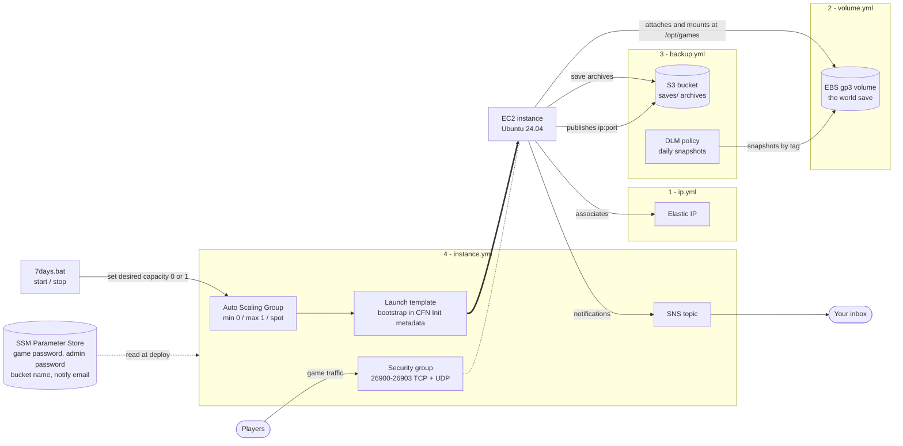
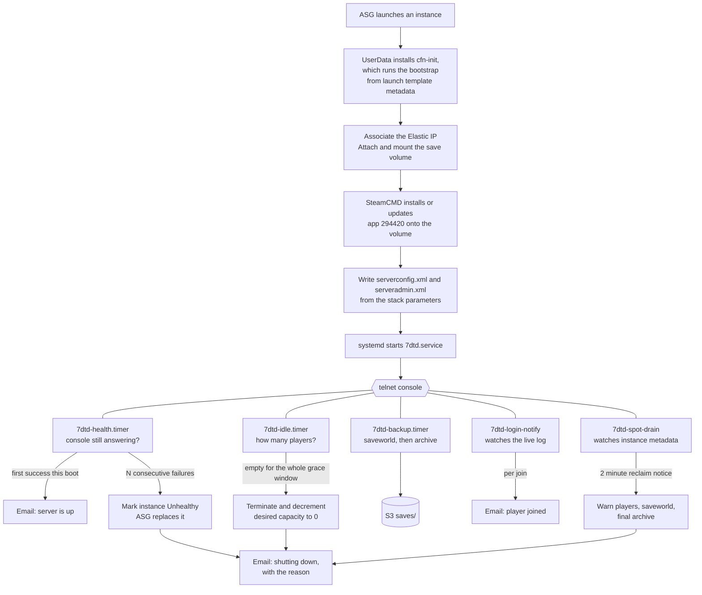

# 7 Days to Die - Dedicated Server on AWS
Run a dedicated 7 Days to Die server that scales to zero when empty, with start/stop access control, idle shutdown when no players connected, self-healing, email notifications when the server starts or stops and when a player logs in, and a static IP address.

## Architecture
The architecture consists of three main components. An EBS volume for the save (100 GB gp3 by default), an Elastic IP Address and an Auto Scaling Group. The ASG runs `MinSize 0 / MaxSize 1`: it holds zero instances when the server is idle (so there is no compute cost) and one instance when the server is up. Max is 1 by design - a 7DTD dedicated server is a single authoritative process owning one world save on one volume, so there is nothing to scale horizontally. The instance defaults to `r8i.xlarge` (4 vCPU / 32 GiB), memory-optimized for large V3.0 random-gen worlds; override the `InstanceType` parameter for smaller maps. The volume is deployed separately, so instances can be re-launched without deleting the volume, keeping any existing game data between instances. Each instance runs Ubuntu 24.04 LTS (The Fun Pimps' officially supported Linux target) and runs the server under systemd. The save volume is mounted at `/opt/games`, the server is installed at `/opt/games/7days`, and the game's user-data folder (worlds, saves, player profiles) is placed at `/opt/games/userdata` so all game state lives on the persistent volume.

Because the ASG launches instances from a launch template rather than managing one persistent instance, each launch re-runs the UserData bootstrap: it self-attaches the save volume, self-associates the Elastic IP, and rewrites `serverconfig.xml`. This makes the template the source of truth (no config drift), but it also means the ASG does not attach the volume or IP for you - the instance does that itself on boot. A stack update that changes the launch template applies on the *next* launch; it does not roll a running server.

The bootstrap also installs the CloudWatch agent, which ships in-guest metrics EC2 does not publish by default - memory, swap and filesystem usage (root and the `/opt/games` save volume) plus CPU breakdown - to the `7DaysServer` CloudWatch namespace, tagged with instance id, instance type and ASG name.

### What each stack creates
The four stacks are deployed in order. Each publishes CloudFormation exports; the instance stack is the only one that consumes them, and it does so at boot from the instance rather than at deploy time, which is why the volume and IP stacks can be replaced without touching it.


```mermaid
flowchart LR
  ssm[("SSM Parameter Store<br/>game password, admin password<br/>bucket name, notify email")]
  bat["7days.bat<br/>start / stop"]
  players(["Players"])
  mail(["Your inbox"])

  subgraph s1["1 - ip.yml"]
    eip["Elastic IP"]
  end

  subgraph s2["2 - volume.yml"]
    vol[("EBS gp3 volume<br/>the world save")]
  end

  subgraph s3["3 - backup.yml"]
    bucket[("S3 bucket<br/>saves/ archives")]
    dlm["DLM policy<br/>daily snapshots"]
  end

  subgraph s4["4 - instance.yml"]
    asg["Auto Scaling Group<br/>min 0 / max 1 / spot"]
    lt["Launch template<br/>bootstrap in CFN Init metadata"]
    sg["Security group<br/>26900-26903 TCP + UDP"]
    sns["SNS topic"]
  end

  ec2["EC2 instance<br/>Ubuntu 24.04"]

  ssm -.->|read at deploy| s4
  bat -->|set desired capacity 0 or 1| asg
  asg --> lt
  lt ==> ec2
  ec2 -->|associates| eip
  ec2 -->|attaches and mounts at /opt/games| vol
  ec2 -->|save archives| bucket
  ec2 -->|publishes ip:port| bucket
  ec2 -->|notifications| sns
  sns --> mail
  dlm -->|snapshots by tag| vol
  players -->|game traffic| sg
  sg -.- ec2
```

### What a launch does
The ASG launches from a launch template rather than managing one persistent instance, so every launch re-runs the whole bootstrap. That is what makes the template the source of truth: the config and admin list are rewritten from stack parameters each time, and cannot drift. It also means the ASG does not attach the volume or the IP for you - the instance does that itself.

Everything that supervises the running game talks to it through the same telnet console, rather than parsing a log file whose name changes every launch.


```mermaid
flowchart TB
  boot["ASG launches an instance"] --> init["UserData installs cfn-init,<br/>which runs the bootstrap<br/>from launch template metadata"]
  init --> claim["Associate the Elastic IP<br/>Attach and mount the save volume"]
  claim --> steam["SteamCMD installs or updates<br/>app 294420 onto the volume"]
  steam --> cfg["Write serverconfig.xml and serveradmin.xml<br/>from the stack parameters"]
  cfg --> run["systemd starts 7dtd.service"]
  run --> console{{"telnet console"}}

  console --- health["7dtd-health.timer<br/>console still answering?"]
  console --- idle["7dtd-idle.timer<br/>how many players?"]
  console --- backup["7dtd-backup.timer<br/>saveworld, then archive"]
  console --- login["7dtd-login-notify<br/>watches the live log"]
  console --- spot["7dtd-spot-drain<br/>watches instance metadata"]

  health -->|first success this boot| up["Email: server is up"]
  health -->|N consecutive failures| unhealthy["Mark instance Unhealthy<br/>ASG replaces it"]
  idle -->|empty for the whole grace window| zero["Terminate and decrement<br/>desired capacity to 0"]
  backup --> s3[("S3 saves/")]
  login -->|per join| joined["Email: player joined"]
  spot -->|2 minute reclaim notice| drain["Warn players, saveworld,<br/>final archive"]
  zero --> stopmail["Email: shutting down,<br/>with the reason"]
  unhealthy --> stopmail
  drain --> stopmail
```

### What actually limits performance
A 7DTD dedicated server is CPU and memory bound, not disk bound. The simulation runs on one dominant thread, so single-core speed sets the ceiling on zombie AI, pathfinding and block updates - which is why `MaxSize` is 1 and there is nothing to gain from scaling out. Memory is the other constraint, and it scales with world size and how many chunks are loaded across your players; that is what the memory-optimized default instance is for.

Disk only shows up in bursts: the first SteamCMD install, world generation, chunk streaming as players travel, and the write spike when the world is saved. Between those, the host's page cache holds the hot region files, so most reads never reach the volume at all. `gp3` gives 3000 IOPS and 125 MiB/s at any size, which covers those bursts with room to spare - spending more on provisioned IOPS buys headroom this workload does not use. The one choice that would genuinely hurt is an HDD-backed type, which is why `VolumeType` does not offer one.

Size the volume for capacity rather than speed: the game install plus SteamCMD is the bulk of it, and the world save grows slowly with explored area.

## Configuration
The main 7 Days to Die server configuration is a `serverconfig.xml` written to `/opt/games/7days/serverconfig.xml` by the instance's bootstrap (defined in `instance.yml`). It is rewritten on every launch from the stack's parameters, so the template is the source of truth and the config never drifts. Nothing about the server needs you to edit the template: everything is a CloudFormation parameter.

As of 7 Days to Die V3.0, gameplay settings (difficulty, zombie speed, loot, blood moon, drop-on-death, day length, air drops, etc.) are no longer individual properties. They are all encoded in a single `SandboxCode` string, exposed here as the `SandboxCode` CloudFormation parameter. Generate your own from the in-game Sandbox Options menu; the default is the standard Adventurer preset.

### Parameters
Every parameter has a working default except `SubnetId`, `VpcId` and `KeyPair`, so a default deployment gives you an unnamed public server with no admins and no join password.

| Parameter | Default | What it does |
| --- | --- | --- |
| `ServerName` | `7 Days to Die on AWS` | Name in the server browser. Also the `Name` tag on the ASG and instances. |
| `ServerDescription` | generic | Description in the server browser. |
| `ServerWebsiteURL` | empty | Website link in the server browser. |
| `ServerVisibility` | `2` | `0` not listed (join by IP), `1` friends only, `2` public listing. |
| `ServerMaxPlayerCount` | `16` | Maximum concurrent players. |
| `ServerReservedSlots` / `ServerReservedSlotsPermission` | `2` / `100` | Slots held for players at or above that permission level. |
| `AdminSteamIds` | empty | Comma-separated SteamID64s to make admins. **Empty means nobody is an admin.** |
| `AdminPermissionLevel` | `0` | Level given to those ids. 0 is full admin, 1000 is a plain player: lower means more power. |
| `GamePassword` | SSM `7days-game-password` | Join password. See below. |
| `AdminPassword` | SSM `7days-admin-password` | Console password. See below. |
| `GameWorld` | `RWG` | `RWG` for random-gen, or a prebuilt world such as `Navezgane`. |
| `GameName` | `SevenDaysOnAws` | Save name. Changing it starts a new world instead of loading the existing save. |
| `WorldGenSeed` / `WorldGenSize` | `SevenDaysOnAws` / `6144` | Random-gen seed and size (4096-16384, multiple of 1024). Only used for `RWG`, and only when the world is first generated. |
| `SandboxCode` | Adventurer preset | V3.0 gameplay settings blob. |
| `PlayerKillingMode` | `2` | 0 none, 1 allies only, 2 strangers only, 3 everyone. |
| `ServerPropertyOverrides` | empty | Anything else in `serverconfig.xml`. See below. |
| `TelnetPort` / `WebDashboardEnabled` / `WebDashboardPort` | `8081` / `true` / `8080` | Console and dashboard. Neither port is opened by the security group. |
| `AutoShutdown` | `enabled` | Whether to scale to zero when empty. |
| `IdleGraceMinutes` / `IdleCheckMinutes` | `120` / `20` | Idle grace window and how often it is checked. |
| `HealthCheckMinutes` / `HealthCheckFailureThreshold` | `5` / `3` | Self-heal poll interval and consecutive failures before replacement. |
| `BackupIntervalHours` | `24` | S3 save-archive cadence during a long session. |
| `DailyRefresh` / `DailyRefreshTime` | `enabled` / `15:00` | Whether the instance replaces itself once a day, and the UTC time it checks. |
| `InstanceType` | `r8i.xlarge` | Must be x86-64: 7DTD has no ARM64 server build. |
| `PortNumber` / `PortNumberTop` | `26900` / `26903` | Game port range opened in the security group. |
| `AddressObjectKey` | `7dserver.txt` | Key under `S3BucketName` holding the server's `ip:port`. |
| `AccessControlTagValue` | `7Days` | Value of the `AccessControl` tag that `7days.bat` and the IAM policy below match on. Give each deployment its own value if you run more than one. |

`volume.yml` takes `VolumeSize` (100 GiB), `VolumeType` (gp3), `AvailabilityZoneSuffix` (`a`), `VolumeName` and `BackupTagValue`. `backup.yml` takes `RetentionDays` (14), `SnapshotTimeUTC` (16:00) and the matching `BackupTagValue`.

### Passwords
There are two, deliberately separate, and both are read from SSM Parameter Store so no password is ever committed to the template:

- **`GamePassword`** is what players type to join. Because an SSM parameter cannot hold an empty string, set it to the literal `none` to run an **open server** that anyone with the address can join. That is the setup this repo's defaults describe: a public listing (`ServerVisibility=2`) with no join password.
- **`AdminPassword`** is the server console (`TelnetPassword`) password. It is an operator credential, not a player one: the idle check, self-heal check, spot drain and login watcher all drive the game through that console. The telnet port is bound on the instance and is not opened by the security group, and the scripts holding this password are root-only (`0700`) so the game process itself cannot read it.

The web dashboard, when enabled, authenticates through the game's own admin/permission system rather than a separate password property, and its port is likewise not exposed by the security group.

### Admins
`AdminSteamIds` is a comma-separated list of SteamID64s (the 17-digit number at the end of a `steamcommunity.com/profiles/...` URL). They are written to `serveradmin.xml` at `AdminPermissionLevel`, which defaults to `0`: full admin. **The default is an empty list, so a fresh deployment has no admins at all** until you name your own.

Because `serveradmin.xml` is rewritten from this parameter on every launch, in-game admin, whitelist and ban edits do not survive a relaunch. Change the parameter and update the stack instead.

### Setting anything else
`ServerPropertyOverrides` reaches every `serverconfig.xml` property that has no parameter of its own: land claims, zombie and animal caps, safe zones, EAC, crossplay, dynamic mesh, and any property added by a future game version. Pass comma-separated `Name=Value` pairs:

```
MaxSpawnedZombies=64,EACEnabled=false,LandClaimSize=71,BedrollDeadZoneSize=30
```

Each pair replaces that property if the template already writes it, and is appended if it does not. A value may contain `=` but not `,`, and any text landing in the XML must be XML-safe (`&amp;` rather than a bare `&`, no double quotes).

## Deployment
There are four CloudFormation templates. `ip.yml` and `volume.yml` can be run in any order. `backup.yml` must run after `volume.yml` (its snapshot policy targets the volume by tag). The instance/ASG template must run last, after all three others (it imports the backup bucket ARN).
  1. Deploy `ip.yml`
  2. Deploy `volume.yml`
  3. Deploy `backup.yml`
  4. Create the following SSM Parameters (plain `String`; the names are themselves parameters of `instance.yml` if you want different ones):
    - `7days-game-password`: the password players type to join, or the literal `none` for an open server (see [Passwords](#passwords))
    - `7days-admin-password`: the server console password
    - `7days-server-ip-bucket`: An S3 bucket name to upload `7dserver.txt`, containing server IP and port in `0.0.0.0:26900` format.
    - `7days-notify-email`: Email address for server start/stop and player login notifications (see [Email notifications](#email-notifications))
  5. Deploy `instance.yml`, passing a `SubnetId` in the same Availability Zone as the volume and EIP (`${AWS::Region}a` by default), plus whichever of the parameters above you want to change - at minimum `ServerName` and `AdminSteamIds`, since a fresh deployment has no admins.
  6. Confirm the SNS email subscription from the "AWS Notification - Subscription Confirmation" email sent to `7days-notify-email`. Until that link is clicked, no notifications are delivered.

The dedicated server (Steam app 294420) is downloaded with an anonymous Steam login, so no Steam credentials are required.

The ASG is created at desired capacity 0 (no instance running), so nothing costs compute until you start the server on demand (see below).

## Backups
`backup.yml` provides two independent layers of protection for the world save, both retained for 14 days by default (`RetentionDays`):

- **S3 save archives (file-level).** The instance tars the `userdata` folder (world saves, generated world, `serveradmin.xml`) plus `serverconfig.xml` and uploads a date-stamped `saves/7dtd-<timestamp>.tar.gz` to the backup bucket. It runs ~10 minutes after each boot, every `BackupIntervalHours` (default 24h) during long sessions, and once on a spot reclaim - always after a `saveworld` so the archive is consistent. Because the server idle-stops when empty, an unchanging world is never re-uploaded. These archives are portable: download one and extract it back into `userdata` to restore, roll back a griefed base, or move the world elsewhere. A bucket lifecycle rule expires them after `RetentionDays`.
- **Daily EBS snapshots (volume-level).** A Data Lifecycle Manager policy snapshots the save volume once a day (by the `Backup: 7dtd-daily` tag set in `volume.yml`), whether or not an instance is attached - and since the volume is usually detached when the server is idle, most snapshots are perfectly clean. Restore by creating a new volume from a snapshot and pointing `volume.yml` (or the `Seven-Days-Server-Disk` export) at it.

Restoring from S3 is the lightweight path for save rollbacks; the EBS snapshots are whole-volume disaster recovery if the volume itself is lost.

### Region and Availability Zone
Deploy all four stacks in the same region; there is no default region baked into the templates. The instance-type default (`r8i.xlarge`, 4 vCPU / 32 GiB) suits a large V3.0 random-gen world - pick an `InstanceType` your region actually offers, and note that 7 Days to Die has no ARM64 server build, so Graviton instances such as `r8g`/`m8g` will not work.

`volume.yml` creates the volume in `${AWS::Region}a` by default (`AvailabilityZoneSuffix`), and the ASG must launch into that same AZ because a single EBS volume attaches to one instance in one AZ. Pass `instance.yml` a `SubnetId` that lives in that AZ. Confirm your chosen instance type is offered there; if not, deploy `volume.yml` with a different `AvailabilityZoneSuffix` and pick a subnet in the matching AZ.

## Usage
Check the S3 bucket (`s3://${S3BucketName}/7dserver.txt`) for the IP and port of the server. Because the address is a static Elastic IP, it stays the same across every launch. Then connect to it using 7 Days to Die. The default game port is UDP/TCP 26900.

### Start/Stop Access Control
If you make an IAM User for people who want to be able to turn on the server on-demand then you can provide them `7days.bat` to enable them to easily turn on and off the server, without them knowing any instance or ASG detail. Starting sets the ASG desired capacity to 1; stopping sets it to 0.

Pass in the action (either start or stop). You can optionally provide an AWS CLI profile name to use instead of the default e.g. `7days.bat start myprofile`

Two environment variables tune it without editing the file: `SEVENDAYS_REGION` (unset means the region the AWS CLI resolves from the profile or environment) and `SEVENDAYS_TAG` (default `7Days`, and must match the `AccessControlTagValue` the instance stack was deployed with).

If you would like to lock down the IAM User to only be able to control this 7 Days server then attach this policy to the user (replacing `7Days` with the `AccessControlTagValue` you deployed with, if you changed it):
```json
{
  "Version": "2012-10-17",
  "Statement": [{
      "Action": [
        "autoscaling:SetDesiredCapacity"
      ],
      "Condition": {
        "StringEquals": {
          "autoscaling:ResourceTag/AccessControl": "7Days"
        }
      },
      "Resource": "*",
      "Effect": "Allow"
    },
    {
      "Effect": "Allow",
      "Action": "autoscaling:DescribeAutoScalingGroups",
      "Resource": "*"
    }
  ]
}
```

### Idle Shutdown
Idle auto-shutdown is controlled by the `AutoShutdown` CloudFormation parameter (`enabled` by default; set it to `disabled` to keep the server running until it is stopped manually via `7days.bat stop`). Because the bootstrap is re-run in place by `cfn-hup` whenever the stack metadata changes, toggling `AutoShutdown` with a stack update enables or disables the idle timer on a *running* server within the cfn-hup poll interval, rather than only on the next launch.

When enabled, a systemd timer (`7dtd-idle.timer`) runs `/usr/local/bin/7dtd-idle-check` every `IdleCheckMinutes` (default 20). It uses an automated telnet connection (`/usr/local/bin/7dtd-listplayers`) to read how many players are currently connected. It only scales the ASG to zero (terminate the instance and decrement desired capacity to 0, so the group stays empty - a plain OS shutdown would just be relaunched) once the server has been positively empty for a continuous `IdleGraceMinutes` window (default 2 hours), so a short lull after the last player disconnects does not tear the server down. The "empty since" timestamp lives on tmpfs (`/run`) and resets each launch; a player being present clears it, and an unreachable console leaves it untouched (a transient telnet blip must not reset the window) and never triggers a scale-down, so the server is also never scaled down before it has started.

### Daily refresh
`DailyRefresh` (`enabled` by default) replaces the instance once a day at `DailyRefreshTime` (UTC, default `15:00`), so a server that stays up for weeks picks up a fresh host, whatever `AMIID` now resolves to, and a fresh spot pool instead of accumulating uptime, leaked memory and unpatched packages on one box. Like `AutoShutdown`, it is toggled on a running server by a stack update, within the cfn-hup poll interval. The default time sits an hour before `backup.yml`'s default `SnapshotTimeUTC`, so the daily EBS snapshot captures a volume that was saved and released minutes earlier.

A systemd timer (`7dtd-refresh.timer`) runs `/usr/local/bin/7dtd-daily-refresh`, which reads the player count over the same telnet console the idle and self-heal checks use, and acts only on a positively empty read:

- **Players connected**: it logs and defers to the next daily fire. A session is never interrupted, which also means a server occupied every day at `DailyRefreshTime` never refreshes.
- **Console unreachable**: it does nothing. A wedged server belongs to the self-heal check, which replaces it on its own terms.
- **Empty**: it takes an S3 save archive (which starts with a `saveworld`), records the reason for the shutdown email, and terminates the instance *without* decrementing desired capacity, so the ASG immediately launches a replacement that reattaches the same volume.

With `AutoShutdown` enabled the refresh rarely has anything to do - an empty server has usually already scaled to zero, and the next start is a new instance anyway. It matters most with `AutoShutdown` disabled, where nothing else ever replaces a healthy instance.

### Email notifications
You get an email when the server becomes joinable, when it shuts down, and every time a player logs in. `instance.yml` creates an SNS topic (`<stack>-notifications`) subscribed to the address in the `7days-notify-email` SSM parameter (kept in SSM, like the server password, so it is not baked into the template). SNS sends a confirmation link when the subscription is first created - **notifications only flow once you click it**, and you have to confirm again if you delete and recreate the instance stack or change the address. Every notification goes through one helper on the instance, `/usr/local/bin/7dtd-notify`, which owns the publish, sanitizes the subject to what SNS accepts, appends the server address, and never fails its caller - a lost email can't change what the server does.

| Event | Subject | Sent by |
| --- | --- | --- |
| Server is joinable | `7DTD: server is up` | `7dtd-health-check`, on its first successful console read this boot |
| Host is shutting down | `7DTD: server is shutting down` | `ExecStop` of `7dtd-stop-notify.service` |
| Player joined | `7DTD: <player> joined the game` | `7dtd-login-notify.service` |

**Server up.** The self-heal check already records the first moment the game answers a console `listplayers` - that is precisely "loaded and joinable" - so the email is sent where that mark is set, once per boot. No extra polling and no dependence on how the game words its log. The cost is up to one health-timer interval (`HealthCheckMinutes`, default 5) of latency, which is minor against the 10+ minutes a launch takes anyway.

**Shutting down.** `7dtd-stop-notify.service` is a `RemainAfterExit` oneshot that does nothing on start and publishes from its `ExecStop`. It is ordered `After=network-online.target`, and because shutdown reverses ordering, systemd stops it - running that hook - while networking and the instance credentials are still up. The email says *why* when the shutdown was self-initiated: the idle check, the spot drain, the daily refresh and the self-heal check each leave a reason in `/run/7dtd-notify/stop_reason` before they act, so you can tell an idle-stop from a spot reclaim from a daily refresh from an unhealthy replacement. A plain `7days.bat stop` leaves no reason and gets the generic wording. It also reports host uptime. Note that a **hard kill sends nothing** (host failure, or any stop without an ACPI shutdown), so no shutdown email is not proof the server is still up. Nothing should ever `systemctl restart` this unit either - that fires `ExecStop` and emails a shutdown that isn't happening - which is why the message text lives in a separate script `cfn-hup` can rewrite in place.

**Player joined.** `7dtd-login-notify.service` holds a long-lived telnet console session (`/usr/local/bin/7dtd-log-stream`) and filters the server's live log for the single global-message line 7DTD writes per login - `INF GMSG: Player 'SomePlayer' joined the game`. Chat lines are dropped before matching, so a player typing a fake join line into chat cannot generate an email. Only joins are notified, not disconnects. Reading the console (rather than the game's own `output_log_dedi__<timestamp>.txt`, which is renamed on every launch) keeps this on the same interface the idle and self-heal checks already use. If the session drops (server restarting, world still generating, spot reclaim), systemd reconnects every 60s; joins during that gap are not emailed.

A game process that crashes and is restarted by systemd within the same boot is not notified either way - only the host shutdown is.

### Self-healing
Two layers keep the server up. The ASG's `EC2` health check replaces an instance whose host fails its status checks (a dead or hung host). On top of that, a systemd timer (`7dtd-health.timer`) runs `/usr/local/bin/7dtd-health-check` every `HealthCheckMinutes` (default 5): if the game console was reachable earlier this boot but then stops responding for `HealthCheckFailureThreshold` consecutive checks (default 3), it marks the instance `Unhealthy` so the ASG replaces the wedged process. It never acts until the server has been healthy at least once (state lives on tmpfs and resets each boot), so a slow first boot or world-gen is never killed.

### Spot instances
The ASG runs on spot via a `MixedInstancesPolicy` (all spot, `price-capacity-optimized`), which is roughly 60-70% cheaper than on-demand. This is safe because the world save lives on the persistent EBS volume: when a spot instance is reclaimed, the ASG launches a replacement that reattaches the same volume and players reconnect - a reclaim costs a reconnect, not the world. A systemd service (`7dtd-spot-drain.service`) polls instance metadata for the ~2-minute interruption notice and issues `saveworld` (plus a player warning) over the telnet console before the instance goes, so at most a few seconds of play are lost.

Because a single EBS volume attaches in one AZ, the ASG is pinned to one AZ and cannot diversify spot pools across AZs; the `Overrides` list in `instance.yml` diversifies across instance *types* within that AZ instead. Tune that list to the ~32 GiB x86 types your region actually offers (7DTD has no ARM build, so no Graviton). Two caveats specific to a single-instance ASG: `CapacityRebalance` is left off (at `MaxSize 1` it can't launch a replacement before terminating, so it would just kick players early), and there is **no automatic spot-to-on-demand fallback** - if every spot pool in the pinned AZ is unavailable, the server stays down until capacity returns. Adding fallback would require a small Lambda that flips the ASG to on-demand when spot can't be fulfilled; it is deliberately not included.

